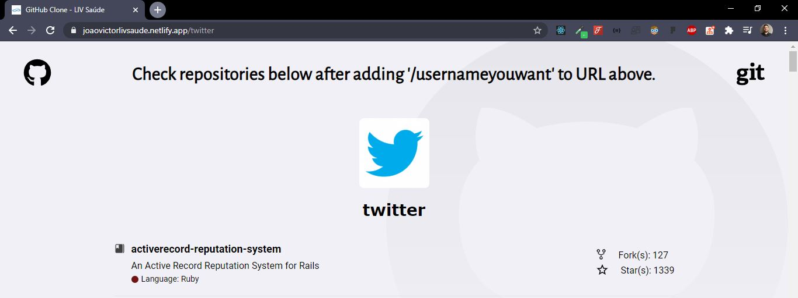
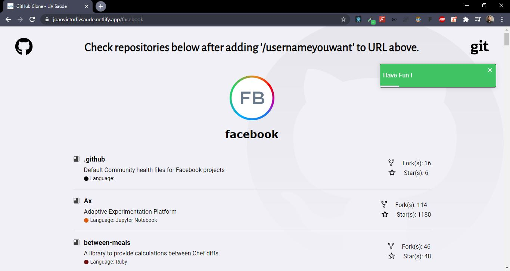
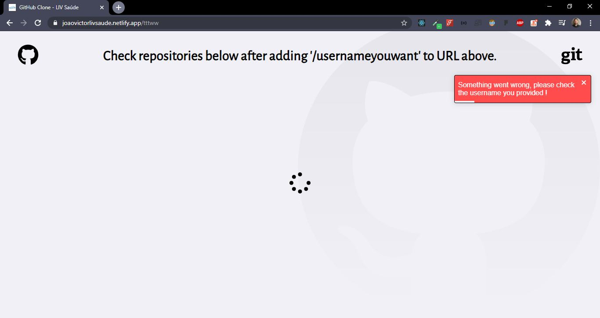

<h1 align="center">
  
</h1>

<h2 align="center">
  GitHub "Clone" - by JV
</h2>

## :computer: About

Application (Web) developed as a test/challenge provided by [LIV Saúde](https://livsaude.com.br/) company using ReactJS. </br>
The main goal is to be able to list the repositories from a GitHub user that exists. Following test's guideline, you're able to 
change the user by typping directly on URL the username '/jvictor-am' (example: https://joaovictorlivsaude.netlify.app/jvictor-am).

## Built with:

<details><summary><b>Click to drop</b></summary>

- React (^16.13.1)
- Node (v12.16.1)
- Yarn (1.17.3)
- Toastify: (^6.0.8)
- Reactotron: (^3.3.7)
- Styled-Components: (^5.1.1)
- Axios: (^0.19.2)

</details>

## :framed_picture: :computer: Application Screens

<h3 align="center">
  



</details>
</h3>

## How to install and run on your computer:

<strong>1. Clone this project and install dependencies</strong>

```
$ git clone https://github.com/jvictor-am/liv-saude-challenge-jv.git
$ cd liv-saude-challenge-jv
$ npm install
or
$ yarn install
```

<strong>2. Run on localhost:3000</strong>

```
$ npm start
or
$ yarn start
```

## Deploy:

<strong>Netilify:</strong> https://joaovictorlivsaude.netlify.app/

<strong>Heroku:</strong> https://joaovictorlivsaude.herokuapp.com/

</br>

---

# Author

[**João Victor**](https://www.linkedin.com/in/jo%C3%A3o-victor-de-andrade-mesquita-848a09122/)

<h2 align="center">
  Thank You!
</h2>
